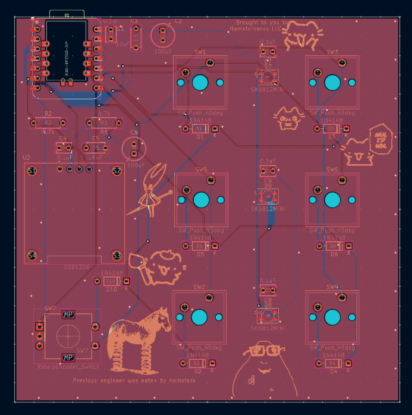

# HackClubMicropad

---

## Table of Contents

- [Overview](#overview)
- [Photos](#photos)
- [Bill of Materials](#bill-of-materials)

---

## Overview

The HackClub Micropad is a compact, USB-HID macropad intended for programmable shortcut input.
It was designed from scratch in KiCad and manufactured via JLCPCB. Firmware runs on CircuitPython.
It is a keybord with a programmable OLED screen, 6 keys, and a rotary encoder.
It is a fun, memorable, and beginner friendly productivity tool.

**Key features:**

- Seeed Studio XIAO RP2350 microcontroller
- Mechanical key switches (MX-compatible footprints)
- Rotary encoder with push-button
- Onboard NeoPixel (WS2812B) RGB indicator
- USB-C connectivity via the XIAO module
- 3D-printed enclosure (FDM, PLA)

---

## Photos

**PCB Top View**

**Assembled Board**

**Case**

---

### Bill of Materials

| Part Number | Description | Quantity | Ordering Location |
| :--- | :--- | :--- | :--- |
| 1597-102010550-ND | Seeed Studio XIAO RP2350 microcontroller (DIP) | 1 | [DigiKey](https://www.digikey.com/en/products/result?keywords=1597-102010550-ND) |
| 4809-EC11E15204A3-ND | EC11 rotary encoder with push-button, 5-pin | 1 | [DigiKey](https://www.digikey.com/en/products/detail/alps-alpine/EC11E15204A3/21721644) |
| 3086-MDOB128064V2V-YI-ND | SSD1306 OLED Screen | 1 | [DigiKey](https://www.digikey.com/en/products/detail/midas-displays/MDOB128064V2V-YI/20842029?s=N4IgTCBcDaIMwAYAcA2AtAWQCIHkBCAjGEgigCwBqYFaAmgJJoByWIAugL5A) |
| 1528-1541-ND | RGB LED with integrated controller (SK6812MINI) | 3 | [DigiKey](https://www.digikey.com/en/products/detail/adafruit-industries-llc/2686/5804107?s=N4IgTCBcDaIIwFYwA4C0iAsdUDkAiIAugL5A) |
| 1644-MX2A-E1NW-ND | Push button switch, normally open, 45° tilted | 6 | [DigiKey](https://www.digikey.com/en/products/detail/cherry-americas-llc/MX2A-E1NW/21738396?s=N4IgTCBcDaIIwDYAsSC0BZAGmAgqgonAHIDqqRAIiALoC%2BQA) |
| 1N4148FS-ND | 100V 0.15A standard switching diode, DO-35 | 7 | [DigiKey](https://www.digikey.com/en/products/detail/onsemi/1N4148/458603?s=N4IgTCBcDaIIwDkAsckA4BiBlAtAgIiALoC%2BQA) |
| 490-8808-ND | Unpolarized capacitor, 0.1uF | 5 | [DigiKey](https://www.digikey.com/en/products/detail/murata-electronics/RDER71E104K0K1H03B/4770963?s=N4IgTCBcDaICwE4AMBaAHGpaUDkAiIAugL5A) |
| 399-C324C106K3R5TA7301CT-ND | Unpolarized capacitor, 10uF | 2 | [DigiKey](https://www.digikey.com/en/products/detail/kemet/C324C106K3R5TA7301/12699356?s=N4IgTCBcDaIMwE4EFoDCcwBZUEYAMAbANJwBKArACoCCA7HHjqpcgHIAiIAugL5A) |
| 732-8825-1-ND | Polarized capacitor, 100uF | 2 | [DigiKey](https://www.digikey.com/en/products/result?keywords=732-8825-1-ND) |
| 56-CCF554K70FKE36CT-ND | Resistor, 4.7k | 2 | [DigiKey](https://www.digikey.com/en/products/detail/vishay-beyschlag-draloric-bc-components/CCF554K70FKE36/28262019?s=N4IgTCBcDaIKwDYC0BhFAxOcAsBpA7AAzq4CiAzAigCpIByAIiALoC%2BQA) |

